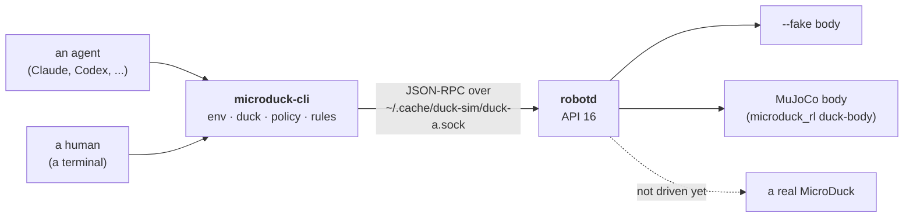
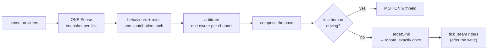

# microduck-cli

One CLI for the [MicroDuck](https://github.com/pollen-robotics/microduck) robot — any agent, any human, the same verbs.



The CLI opens **one** unix socket, speaks the daemon's JSON-RPC protocol, and never
links a robotics SDK: `dependencies = []` in `pyproject.toml` is the whole runtime
dependency list. Everything below was run at **microduck-cli 0.9.4** and checked
against that version's own `--help`.

## Install

```bash
uv tool install microduck-cli     # or: uvx microduck-cli whoami
microduck --version
```

Two console scripts install and are the same entry point: `microduck` (short) and
`microduck-cli` (the distribution name, and the name the CLI prints in its own
output). From a checkout, every command below also works as `uv run microduck …` —
that is the form [`docs/operating-the-duck.md`](docs/operating-the-duck.md) uses:

```bash
git clone https://github.com/agentculture/microduck-cli && cd microduck-cli
uv sync && uv run microduck whoami
```

Python ≥ 3.12. The verified platform is **Linux on aarch64** (see [Proof](#proof--three-boxes));
no x86_64 or macOS run is on record.

## What it is (and is not)

**Is.** Five noun groups, every verb reachable with `--json`, results on stdout and
diagnostics on stderr, never mixed. Exit codes: `0` success, `1` user error, `2`
environment error.

| Noun | Verbs |
|------|-------|
| `env` | `overview` `doctor` `up` `down` `status` `hosts` — bring up, diagnose and tear down the simulator (`duck-body` + `robotd --sim`) or a `robotd --fake` stand-in. |
| `duck` | `overview` `health` `version` `monitor` `init` `relax` `enable` `do` `mode` `look` `stop` `move` `quack` `configure` `record` — operate one duck, in `robotctl`'s own words. |
| `policy` | `overview` `list` `load` `reset` `add` `remove` `search` `check` `update` `pad` `smoke` `train` `play` `export` `publish` `infer` `install` — the policy lifecycle plus the `microduck_rl` train lane. |
| `rules` | `overview` `list` `check` `engine` `intent` — the data-only rules layer and the one 50 Hz tick engine that evaluates it. |
| `cli` | `overview` — CLI-surface introspection; the agent front door is `microduck learn` and `microduck explain <path>`. |

**Is not.**

- **No physical MicroDuck has ever been driven from this CLI.** Every verb is
  exercised against `robotd --fake`, the MuJoCo body, and an in-process fake daemon
  (`tests/fake_robotd.py`). The CLI says so itself: `microduck learn`.
- **Locomotion is not achieved at the current pin.** `duck move` reaches the daemon
  and the walk network is selected, but its joint targets are static — the duck
  stands where it is. Recorded in full below.
- **The policy channel is unavailable on this daemon** (approved deviation `d1`):
  `robot.policies` / `robot.loadPolicy` / `robot.setSkill` need API ≥ 18, the pinned
  `sim-remote-io` build answers API 16, and those verbs exit 2 saying exactly that.
- **[`neurosymbolic-system`](https://github.com/agentculture/neurosymbolic-system) is
  not a dependency.** The runtime this CLI is meant to import is still a bare
  scaffold, so the tick engine lives in `microduck_cli/behavior/` for now, written
  behind the seams that extraction will need ([`CLAUDE.md`](CLAUDE.md), decision c20).

**If you do have a duck:** motion verbs are gated. On a pipe without `--apply` they
print a dry-run plan and move nothing; on a TTY they ask. And `duck relax` drops
torque — a duck with no torque **falls over**. `microduck_cli/behavior/release.py`
deliberately never sends `robot.relax`, not even on a crash.

## Try it in simulation

**Prerequisites.** Two upstream clones at the pinned commits
([`docs/upstream-pins.md`](docs/upstream-pins.md)) and a Rust toolchain. Without them
`env doctor` fails seven of its thirteen checks — that is the box, not the CLI. Point
`MICRODUCK_CLONE` and `DUCK_SIM_RL` at the clones and ask:

```bash
microduck env doctor      # 13 checks: clone pins, cargo, daemons built, RL venv, port, state dir
```

Then, in order — this numbered walkthrough is the plain-text equivalent of the
diagrams above and below, for readers whose renderer shows a `mermaid` fence as code:

1. **Bring up a duck.** `--fake` needs no simulator; swap in `--sim --headless` for
   the MuJoCo body.

   ```bash
   microduck env up --fake
   ```

2. **Ask the robot for its own verdict.**

   ```bash
   microduck duck health
   ```

3. **Stand it up, then hand it its policy.** Both are gated, hence `--apply`.

   ```bash
   microduck duck init --apply
   microduck duck enable --apply
   ```

4. **Run the tick engine briefly.** Connect, hello, health, init, enable, armed —
   each step logged, then 50 ticks at 50 Hz.

   ```bash
   microduck rules engine run --max-ticks 50 --apply
   ```

5. **Inject one intent** through the same admission registry a rule fires through.

   ```bash
   microduck rules intent stop
   ```

6. **Tear it down.** Never kill by name — `env down` is the supported path.

   ```bash
   microduck env down
   ```

[`docs/operating-the-duck.md`](docs/operating-the-duck.md) walks the same six
commands with each one's exact output and what to do when a check fails; the
first-party [`operate-microduck`](.claude/skills/operate-microduck/SKILL.md) skill is
the same ground for an agent, including the screenshot recipe for watching the MuJoCo
window from a headless session.

## Proof — three boxes

Everything in this section is copied from the verification records in
[`docs/verification/`](docs/verification/), not retyped. **Home directories are
shortened to `~`; nothing else is changed.** Each record names the box, the upstream
pins, the daemon API and the CLI commit it was recorded at — and nothing re-runs
them, so a re-pin ages them silently. Check the record's date against the pins table
before trusting a number here.

| Box | Reached | Result | Caveat |
|---|---|---|---|
| **DGX Spark** (GB10, aarch64) | all six checks + train smoke | pass; live suite **12 passed, 0 failed** | walking `xfail` |
| **Jetson AGX Thor** (JetPack 7) | all six checks, three tiers, headless | pass; **12 passed, 1 xfailed** | ran on an *uncommitted* local torch override; the upstream fix is still open as [microduck_rl#39](https://github.com/pollen-robotics/microduck_rl/pull/39) (issue [#38](https://github.com/pollen-robotics/microduck_rl/issues/38)), so `env doctor`'s `rl_pinned_commit` fails there **by design** until it merges and this repo re-pins |
| **Jetson AGX Orin** (L4T R39) | checks 1–4 | pass | the SBSA torch wheel carries no `sm_87` kernels — GPU training is **not available** on Orin at this pin |

**A duck standing up in MuJoCo** — [Spark](docs/verification/2026-09-04-sim-bringup.md), CLI `420dc5c`:

```text
$ microduck env up --sim --headless --skip-build
waiting for duck-a to report healthy (~/.cache/duck-sim/duck-a.sock)...
microduck-cli env up: healthy (sim)
  duck-a: ~/.cache/duck-sim/duck-a.sock
$ microduck duck init --apply --json
{... "summary": "init accepted: ramping to the home pose", "result": {"accepted": true}}
$ microduck duck monitor --frames 2 --json     # 8 s later
{'policy': 'held', 'fallen': False, 'gravity': [-0.028, -0.00004, -0.9996], 'z': 0.0687, 'loop': {'hz': 50.03, 'missed': 0}}
```

The same trunk height, to four decimals, on a different box —
[Orin](docs/verification/2026-09-04-orin-sanity.md), CLI `3c09fb0` (0.9.1):

```text
$ microduck duck health --json
{"healthy": true, "degraded": false, "health": {"control_loop": {"target_hz": 50.0,
 "achieved_hz": 49.999974411777806, "ticks": 900, "missed": 0, "last_tick_age_ms": 17}, ...}}
```

**A rule firing, and a drop that says why** — Spark, one overlay rule (`fallen` is
false → `look`, cooldown 5 s) over a 300-tick run:

```text
$ microduck rules engine run --duck duck-a --rules /tmp/duck-rules-test.toml --apply --max-ticks 300 --json
{'ticks': 300, 'achieved_hz': 50.0, 'overruns': 0}
[SENSE stage=rule source=verify-look event=fired] look -> look-1
[SENSE stage=rule source=verify-look event=cooldown] dropped reason=cooldown: fired 0.020s ago, cooldown_s is 5.0
```

229 cooldown drops over the run, every one named on the `microduck.sense` logger —
stderr only, so JSONL on stdout stays pure. A layer whose drops are invisible is
indistinguishable from one that silently does nothing.

**The live suite against a real daemon** — [Thor](docs/verification/2026-09-04-thor-sanity.md), CLI `2b00480`, MuJoCo body:

```text
$ MICRODUCK_LIVE=1 MICRODUCK_LIVE_BODY=sim MICRODUCK_LIVE_SIM=1 ... uv run pytest -m live -n0 -v tests/live
(the eleven above) PASSED
test_sim_body_stands_the_duck_up PASSED
test_sim_body_walks_forward_on_move XFAIL
======================== 12 passed, 1 xfailed in 26.65s ========================
```

Those twelve drive the CLI as subprocesses against the real socket. The unit suite
(1101 tests at 0.9.4; the records above were taken at 998) does not — it runs against
the in-process Python fake.

## Not verified

Stated plainly, because a record that only lists passes is a brochure:

- **No physical duck.** The `--fake` and MuJoCo bodies only.
- **Walking.** Sampled at 25 Hz during `duck move --vx 0.15`: `policy: walk`,
  `move.applied [0.15, 0, 0]`, `fallen: false` — and the left-knee target moves
  between −0.09 and −0.05 rad over 97 frames while odometry goes 0.065 → 0.072 m in
  4.4 s. The twist arrives, the network is selected, the joint targets are static.
  Ruled out: our command shape (identical to upstream's `drive`), the generated
  params, the keyframe, the real-time factor (1.00) and the viewer.
  `test_sim_body_walks_forward_on_move` is kept as a non-strict `xfail` sentinel — an
  XPASS after a re-pin means walking arrived.
- **Upstream's own torch routing on Thor** — every tier there ran on the local
  override, not as shipped.
- **GPU training on Orin** — no `sm_87` kernels in the SBSA wheel.
- **A real Hugging Face Jobs submission** — the dry run proves the command shape and
  the tarball, nothing was submitted or billed.
- **Multi-duck, the ether, cameras and ToF** in sim — upstream marks them "designed
  and measured but not built" on this branch.

## The tick engine

One process owns the control socket. robotd arbitrates nothing between clients, so a
second process would be two authors fighting over every channel — hence one loop,
one seam, riders composed onto it:



Per tick, in this order: read one `Sense`; ask each live behaviour once; arbitrate a
single owner per channel; compose; write through the sink **exactly once**; run the
tick seam **after** the write; expire finished lifetimes; sleep to an absolute
deadline. No wall-clock read anywhere in the loop — `clock` and `sleep` are injected,
which is what makes a 500-tick run bit-for-bit reproducible in a test. A provider
that raises degrades to `None`; a rider that raises is caught, counted and logged as
a named drop while its siblings still run.

[`CLAUDE.md`](CLAUDE.md) has the rest: the seam rules, how to add a verb or a noun,
the error and output contracts, and the agent-first rubric CI enforces.

## Cited from / built on

Nothing from these repositories is copied into this one. The CLI implements their
documented commands and wire protocol and links to their docs — cite, don't import.

**Upstream** — the exact commits every verb is validated against are in
[`docs/upstream-pins.md`](docs/upstream-pins.md); re-pinning is one PR that moves all
rows and re-runs the on-box verification.

| Repo | What this CLI takes |
|---|---|
| [`pollen-robotics/microduck`](https://github.com/pollen-robotics/microduck) | `robotd`, `robotctl` and the `duck-ipc-proto` JSON-RPC contract that `microduck_cli/ipc/proto.py` is transcribed from. |
| [`pollen-robotics/microduck_rl`](https://github.com/pollen-robotics/microduck_rl) | `duck-body` (the MuJoCo body) and the train / play / export / publish / infer lane the `policy` noun drives. |

**AgentCulture siblings** — this CLI is composed from three of them rather than
inventing a fourth architecture.

| Repo | Role here |
|---|---|
| [`neurosymbolic-system`](https://github.com/agentculture/neurosymbolic-system) | The runtime to **import** once it ships — not a dependency today; `microduck_cli/behavior/` holds the tick engine behind extraction-ready seams. |
| [`reachy-mini-cli`](https://github.com/agentculture/reachy-mini-cli) | The architecture: noun groups with engine logic in sibling packages, ONE tick seam for every sense, the single-SDK-owner model. |
| [`arm101-cli`](https://github.com/agentculture/arm101-cli) | The hardware-safety patterns: gated motion (dry-run / TTY confirm / `--apply`), release-on-abnormal-exit, hardware deps behind an extra. |
| [`teken`](https://github.com/agentculture/teken) | The agent-first rubric (`teken cli doctor . --strict`) that gates CI. |
| [`devague`](https://github.com/agentculture/devague) | The spec → plan → delivery method this repo builds by; see [`docs/specs/`](docs/specs/) and [`docs/deliveries/`](docs/deliveries/). |

Vendored skills under `.claude/skills/` carry their provenance in
[`docs/skill-sources.md`](docs/skill-sources.md).

## Contributing

[`CLAUDE.md`](CLAUDE.md) is the working agreement: CLI contracts, what to take from
each sibling, version-bump-every-PR, the `cicd` PR lane, worktree layout, memory
discipline.

```bash
uv sync
uv run pytest -n auto                          # 1101 tests
uv run teken cli doctor . --strict             # the agent-first rubric gate CI runs
markdownlint-cli2 "**/*.md" "#node_modules" "#.local" "#.claude/skills" "#.teken"
```

## License

Apache 2.0 — see [`LICENSE`](LICENSE).
